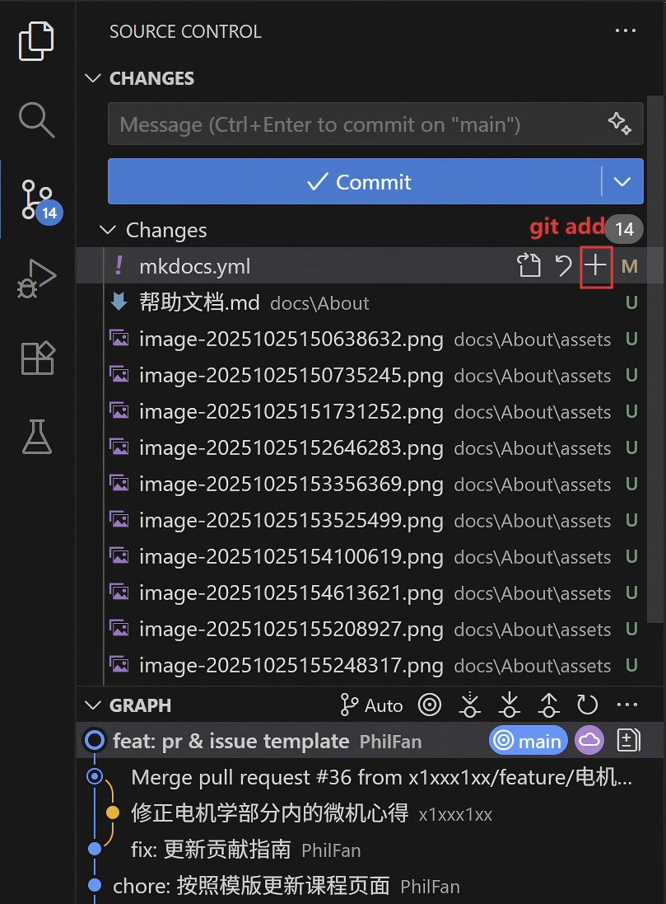
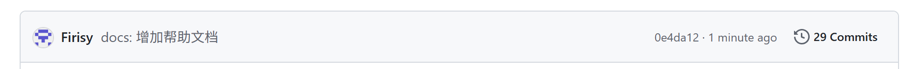
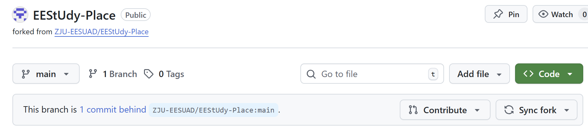
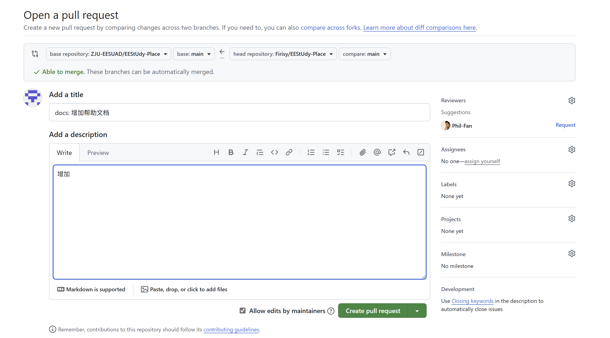

# 从 0 开始加入“电院一站式学习资料”计划

> 作为一个刚刚诞生的网站，这里仍然有许多地方并不完美，需要电院的各位一起逐步完善。

**完全不用担心没有基础**！这篇文档就是为完全没有相关知识的"小白"准备的。如果在任何步骤遇到困难，欢迎随时联系我们：

📧 **邮箱**: [eesuad_zju@163.com](mailto:eesuad_zju@163.com)

## 0 轻松开始

让我们从 0 轻松开始。

在开始之前，你需要准备以下工具：

| 工具        | 用途           | 相关链接                                                     |
| ----------- | -------------- | ------------------------------------------------------------ |
| GitHub 账号 | 代码托管和协作 | [GitHub 注册](https://github.com/signup)                     |
| VSCode      | 代码编辑器     | [Visual Studio Code 下载](https://code.visualstudio.com/)    |
| Git         | 版本控制工具   | [Git 下载](https://git-scm.com/install/windows)，下载完成后需要进行初始化用户名和邮箱 |
| Python      | 运行环境       | [Python 下载](https://www.python.org/downloads/)             |

* Git 初始化用户名和邮箱

  ```cmd
  git config --global user.name "<你的名字>"
  git config --global user.email <你的邮箱>
  ```

> 💡 **温馨提示**: 如果下载安装遇到问题，可以先搜索相关教程，或者直接联系我们寻求帮助！

### 0.1 将文件从 GitHub 上下载下来

构建网站的所有代码，请你[单击这里](https://github.com/ZJU-EESUAD/EEStUdy-Place)，直达我们的 GitHub 仓库。

> 想象一下，我们的网站所有代码都放在一个"云盘文件夹"里，这个"云盘文件夹"就是 **GitHub 仓库**。

你会看到如下 GitHub 仓库网页常见界面。


由于该网站是多人合作项目，作为网站的新贡献者，建议你按下面的流程在 GitHub 上协作以保证代码整洁、可追溯并便于审查。

1. **创建 fork**：在仓库网页上找到`Fork`→`+ Create a new fork`;

   > **Fork（分叉）就是将一个别人的代码仓库（Repository）完整地复制到你自己的 GitHub 账户下。**
   >
   > 你在图书馆看到一本非常棒的书（原始项目），你想在上面做笔记、修改内容，但又不能直接在原书上涂画。于是，你把这整本书**复印**了一份带回家（**Fork** 到你的账户）。这份复印件完全属于你，你想怎么修改都可以，而原书依然完好无损地留在图书馆里。

   

   网页跳转到如下界面，基本设置之后（基本不用改动），单击`Create fork`;

   

   与第一张图片对比，现在仓库（Repository）不再在**ZJU-EESUAD**名下，而是**完完全全归属于你自己**啦。**在这个仓库中的任意操作都不会影响原仓库（方便你学习、实践、调试）**~

   

2. **下载仓库到本地**：我们使用**VSCode**作为代码编辑器（IDE），如果你没有下载，VSCode 下载链接在这里：[Visual Studio Code - Code Editing. Redefined](https://code.visualstudio.com/)

   点击`File`→`Open Folder`，会跳出文件夹的界面，请你选择你希望仓库被下载下来之后的位置（如图所示，我下载在`MYREPOSITRY`位置）；

   

   文件夹被打开后，现在我们通过命令行的形式将仓库克隆（Clone）到本地。

3. **命令行 Clone 仓库**：打开 VSCode 的终端界面，可以通过`View`→`Terminal`的方式打开终端；

   

   在终端中输入以下命令（需要先复制你的仓库地址）：

   ```bash
   git clone https://github.com/<你的用户名>/<你的仓库名>.git
   ```

   > 📍 **如何获取仓库地址？**
   > 在你的 GitHub 仓库页面，点击绿色的 **Code** 按钮，复制 HTTPS 链接

   看到下面这段代码，并且左侧文件目录出现文件，说明成功下载下来啦！

   

   **！** **切换到项目文件夹**：我们现在的工作目录是仓库的下载位置（MYREPOSITRY），但是我们需要工作在仓库位置（MYREPOSITRY/EEStUdy-Place），**因此需重新通过打开文件夹`File`→`Open Folder`的方式，将工作目录调整到（MYREPOSITRY/EEStUdy-Place）**。

   

4. **查看仓库的远程地址**：验证通过下面的几步验证你确实完成了仓库的完整下载。

   **查看本地仓库的远程仓库配置**

   ```bash
   git remote -v
   ```

   显示 远程仓库的名称“origin”地址“<https://github.com/Firisy/EEStUdy-Place.git”>

   ```bash
   origin  https://github.com/Firisy/EEStUdy-Place.git (fetch)
   origin  https://github.com/Firisy/EEStUdy-Place.git (push)
   ```

### 0.2 尝试将网页布置在本地

本网站的建设通过 MkDocs 完成，你需要下载相关的安装包。我们假设你已经完成了 Python 的下载。

> **MkDocs** 是一个快速、简单、漂亮的静态网站生成器，专门用于创建项目文档。它使用 Markdown 来编写内容，并生成一个静态的、可部署的网站。

1. **下载依赖项**：请你确保自己下载了 python，使用下载命令 pip 进行下载；

   ```bash
   pip install -r requirements.txt
   ```

   > ⚠️ **如果出现错误**：
   >
   > * 确保已安装 Python
   > * 尝试使用 `pip3` 代替 `pip`
   > * 或者在命令前加上 `python -m`，如：`python -m pip install -r requirements.txt`

2. **本地运行网站**：让我们简单运行一下，输入下面的命令

   ```bash
   mkdocs serve
   ```

   等待几秒钟，你会看到类似信息：

   ```bash
   INFO    -  [16:14:18] Serving on http://127.0.0.1:8000/
   ```

   好啦，现在在浏览器中输入上面出现的最后一行中的网址`http://127.0.0.1:8000/`，打开建设好的网站。

   

> 🔍 **关于警告信息**：
> 如果看到一些 WARNING 或 ERROR，不用紧张！只要最后出现 `Serving on http://127.0.0.1:8000/` 就说明运行成功了。

## 1 了解 MkDocs

你可以并不深入了解内部的原理，但是难以避开的是对 MkDocs 命令的基本使用，我们将基本讲解 MkDocs 以及网站构建中各个文件的用处与含义。

> **MkDocs** 是一个快速、简单、漂亮的静态网站生成器，专门用于创建项目文档。它使用 Markdown 来编写内容，并生成一个静态的、可部署的网站。

### 1.1 MkDocs 中的命令

我们以 MkDocs 基本命令来讲解其运行方法。

| 命令            | 用途             | 使用场景           |
| --------------- | ---------------- | ------------------ |
| `mkdocs serve`  | 🚀 启动本地服务器 | 预览和测试网站修改 |
| `mkdocs build`  | 🔨 构建网站文件   | 生成最终网站文件   |
| `mkdocs --help` | ❓ 查看帮助       | 忘记命令时使用     |

### 1.2 文件树结构

```text
EEStUdy-Place/          # 项目根目录
├── mkdocs.yml          # 🎛️ 网站配置文件
├── requirements.txt    # 📦 所需工具清单
├── docs/              # 📁 所有网站内容
│   ├── index.md       # 🏠 网站首页
│   ├── 课程资料/      # 📖 按课程分类的文件夹
│   │   ├── 电路原理/
│   │   ├── 信号与系统/
│   │   └── ...
│   └── About/         # ℹ️ 关于网站的信息
└── site/              # 🌐 生成的网站文件（自动创建）
```

## 2 将你的修改上传

### 2.1 创建你的工作分支

在修改任何文件之前，先创建一个新的"工作区域"（分支）：

```bash
git checkout -b <feature/课程名称-你的贡献类型>
```

<feature/课程名称 - 你的贡献类型>部分的内容替换成你的内容，如`feature/电路原理-课程攻略`。

> 🌟 **分支命名建议**：
>
> * `feature/课程名称-内容类型`
> * `fix/修复的问题描述`
> * `docs/文档更新内容`

当你对文档进行修改后，可以在 VSCode 的可视化 Git 界面看到，如下图，我对`mkdocs.yml`进行了修改（M, Modified），添加了一些以前没有出现在仓库中的 PNG 图片文件（U，Untracked）。



### 2.2 保存你的修改

作为 git 提交修改的基本流程


1. 你需要将文件通过`git add`加到暂存区，可以通过以下命令：

   ```bash
   git add <文件路径>
   ```

   如果需要把所有修改的文件都添加到暂存区，可以使用下面的命令：

   ```bash
   git add .
   ```

   也可以通过 VSCode 的可视化 Git 界面，点击`+`号将文件添加到暂存区。

2. 通过`git commit`将暂存区的所有内容，使用下面的命令（<>包含的内容需要你来修改）：

   ```bash
   git commit -m "<填写你修改的内容>"
   ```

   <填写你修改的内容>模板：“**<功能>: <描述>**”

   > 其中<功能>有下面这几种标签：
   >
   > * feat: 新功能
   > * fix: 修复 bug
   > * docs: 仅修改了文档
   > * style: 修改代码格式（空格、分号等，不影响代码逻辑）
   > * refactor: 代码重构（既不是修 bug，也不是加功能）
   > * perf: 性能优化
   > * test: 增加或修改测试用例
   > * chore: 构建过程或辅助工具的变动（如更改配置文件）

3. **上传到 GitHub**，通过`git push`将更改更新到远程的 GitHub 仓库中：

   ```bash
   git push origin main
   ```

   

   可以看到，在 GitHub 网站上更新了我们的 Commit。

### 2.3 提交贡献（Pull Request）

这是最后一步！让管理员将你的修改合并到主网站中。

1. 访问你的 GitHub 仓库页面；

2. 点击下图中的`Contribute`按钮；

   

3. 将我们的更新通过 Pull Request 更新到我们的老父亲仓库`ZJU-EESUAD:EEStUdy-place`；

   

   请你根据提供的模板，编写标题（Add a title），提供 Pull Request 的描述（Add a description）。随后按`Create pull request`即可，等待管理员的合并吧。

如果还有疑问，可以查看[创建拉取请求 - GitHub 文档](https://docs.github.com/zh/pull-requests/collaborating-with-pull-requests/proposing-changes-to-your-work-with-pull-requests/creating-a-pull-request)。

## 🎉 欢迎加入贡献者行列

感谢你愿意花时间参与网站建设！每一个小小的贡献，都在让我们的学习资源变得更好。

**记住**：

* 🌱 每个人都是从零开始学习的
* 💪 犯错是学习过程的一部分
* 🤗 我们是一个互助的社区

期待看到你的第一个贡献！✨

下面这些链接是官方文档，可以弥补我们帮助文档部分内容不够详尽的问题。

* [GitHub Docs](https://docs.github.com/zh)
* [Material for MkDocs](https://squidfunk.github.io/mkdocs-material/)
