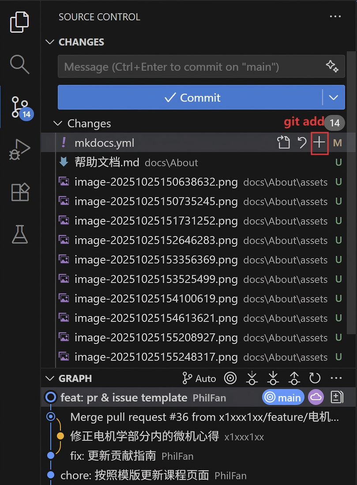
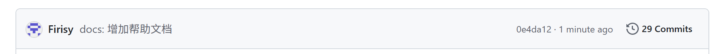

---
[TOC depth=3]
---
# 从0开始加入“电院一站式学习资料”计划

Written by: Firisy Date: 2025/10/25

作为一个刚刚诞生的网站，这里仍然有许多地方并不完美，需要电院的各位一起逐步完善。

这篇文档为完全没有相关知识的“小白”准备，如果有任何不清楚的地方，欢迎大家通过Email: [eesuad_zju@163.com](mailto:eesuad_zju@163.com)联系我们。

## 0 轻松开始

让我们从0轻松开始。下面这些链接是官方文档，可以弥补我们帮助文档部分内容不够详尽的问题。

* [GitHub Docs](https://docs.github.com/zh)
* [Material for MkDocs](https://squidfunk.github.io/mkdocs-material/)

### 0.1 将文件从GitHub上下载下来

构建网站的所有代码，放置在GitHub仓库内（你需要注册一个GitHub账号），[单击这里，直达我们的GitHub仓库](https://github.com/ZJU-EESUAD/EEStUdy-Place)。

你会看到如下GitHub仓库网页常见界面。


由于该网站是多人合作项目，作为网站的新贡献者，建议你按下面的流程在 GitHub 上协作以保证代码整洁、可追溯并便于审查。

1. 创建一个fork，“`Fork`-`+ Create a new fork`”;

   > **Fork（分叉） 就是将一个别人的代码仓库（Repository）完整地复制到你自己的 GitHub 账户下。**
   >
   > 你在图书馆看到一本非常棒的书（原始项目），你想在上面做笔记、修改内容，但又不能直接在原书上涂画。于是，你把这整本书**复印**了一份带回家（**Fork** 到你的账户）。这份复印件完全属于你，你想怎么修改都可以，而原书依然完好无损地留在图书馆里。

   

   网页跳转到如下界面，基本设置之后（基本不用改动），单击`Create fork`;

   
   
   与第一张图片对比，现在仓库（Repository）不再在ZJU-EESUAD名下，而是**完完全全归属于你自己**啦，**在这个仓库中的任意操作都不会影响原仓库（方便你学习、实践、调试）**~
   
   

2. 将这个归属于你的仓库下载到本地。我们使用**VSCode**作为代码编辑器（IDE），如果你没有下载，VSCode下载链接在这里：[Visual Studio Code - Code Editing. Redefined](https://code.visualstudio.com/)

   点击`File`-`Open Folder`，会跳出文件夹的界面，请你选择你希望仓库被下载下来之后的位置（如图所示，我下载在`MYREPOSITRY`位置）；

   

   文件夹被打开后，现在我们通过命令行的形式将仓库克隆（Clone）到本地。

3. 打开VSCode的终端界面，可以通过“`View`-`Terminal`”的方式打开终端；

   

输入命令，其中仓库地址来自于`Code`（如下图所示），注意更改语句中的地址（按照网页显示的内容）；该命令需要你下载Git，下载地址在这里，[Git - Install](https://git-scm.com/install/)；


```powershell
git clone https://github.com/<你的用户名>/<你的仓库名>.git
```

看到下面这段代码，并且左侧文件目录出现文件，说明成功下载下来啦！


**！**我们现在的工作目录是仓库的下载位置（MYREPOSITRY），但是我们需要工作在仓库位置（MYREPOSITRY/EEStUdy-Place），因此需重新通过打开文件夹`File`-`Open Folder`的方式，将工作目录调整到（MYREPOSITRY/EEStUdy-Place）。


4. 通过下面的几步验证你确实完成了仓库的完整下载。

   **查看本地仓库的远程仓库配置**

   ```cmd
   git remote -v
   ```

   显示 远程仓库的名称“origin”  地址“https://github.com/Firisy/EEStUdy-Place.git”

   ```cmd
   origin  https://github.com/Firisy/EEStUdy-Place.git (fetch)
   origin  https://github.com/Firisy/EEStUdy-Place.git (push)
   ```


### 0.2 尝试将网页布置在本地

本网站的建设通过MkDocs完成，你需要下载相关的安装包。我们假设你已经完成了Python的下载。

> **MkDocs** 是一个快速、简单、漂亮的静态网站生成器，专门用于创建项目文档。它使用 Markdown 来编写内容，并生成一个静态的、可部署的网站。

1. 下载仓库正常运行的依赖项

   ```cmd
   pip install -r requirements.txt
   ```

2. 让我们简单运行一下，输入下面的命令

   ```cmd
   mkdocs serve
   ```

   等待几秒钟，随后出现了下面这些文字，请你忽略其中的（WARNING、ERROR，他一定能成功运行的）

   ```cmd
   (base) PS D:\MyRepositry\EEStUdy-Place> mkdocs serve
   INFO    -  Building documentation...
   INFO    -  Cleaning site directory
   WARNING -  Doc file 'CONTRIBUTING.md' contains a link 'Template.md', but the target is not found among
              documentation files.
   WARNING -  Doc file 'About/关于网站.md' contains a link 'Contributing.md', but the target
              'About/Contributing.md' is not found among documentation files.
   WARNING -  Doc file 'About/关于网站.md' contains a link 'Contributing.md', but the target
              'About/Contributing.md' is not found among documentation files.
   WARNING -  Doc file 'About/关于网站.md' contains a link 'Contributing.md', but the target
              'About/Contributing.md' is not found among documentation files.
   ERROR   -  处理目录失败: bad escape \E at position 5136 (line 75, column 60)
   INFO    -  Documentation built in 15.14 seconds
   INFO    -  [16:14:18] Watching paths for changes: 'docs', 'mkdocs.yml'
   INFO    -  [16:14:18] Serving on http://127.0.0.1:8000/
   ```

   好啦，现在在浏览器中输入上面出现的最后一行中的网址`http://127.0.0.1:8000/`，打开建设好的网站。

   

## 1 了解MkDocs

你可以并不深入了解内部的原理，但是难以避开的是对MkDocs命令的基本使用，我们将基本讲解MkDocs以及网站构建中各个文件的用处与含义。

> **MkDocs** 是一个快速、简单、漂亮的静态网站生成器，专门用于创建项目文档。它使用 Markdown 来编写内容，并生成一个静态的、可部署的网站。

### 1.1 MkDocs中的命令

我们以MkDocs基本命令来讲解其运行方法。

1. `mkdocs serve`

   上文已经提到过了，可以在本地查看编辑之后的网站。

2. `mkdocs build`

   将文档构建成网站，在/site文件夹中。

3. `mkdocs --help`

   命令帮助，查看命令的所有用法。

### 1.2 文件树结构

```text
my-project/
    mkdocs.yml     # 配置文件
    requirements.txt # 仓库依赖项
    .gitignore	   # git忽略文件，在其中的文件不会被git跟踪
    docs/		   # MkDocs中所有的文档内容
        index.md   # 首页
        ...		   # 根据课程分类成各个文件夹
```

### 1.3 配置文件 (mkdocs.yml) 基础

```yaml
site_name: My Awesome Documentation
site_description: 我的项目文档
site_author: 你的名字

# 主题设置
theme:
  name: material  # 使用 Material 主题

# 导航菜单
nav:
  - Home: index.md
  - About: about.md
  - Guide:
    - Installation: guide/installation.md
    - Usage: guide/usage.md

# 插件
plugins:
  - search
```

所有docs的文件都会根据mkdocs.yml进行更新

## 2 将你的修改上传

将你的修改提交给原仓库的管理者进行审核，这整一个过程即为**PR（Pull-Request）**。

当你对文档进行修改后，可以在VSCode的可视化Git界面看到，如下图，我对`mkdocs.yml`进行了修改（M, Modified），添加了一些以前没有出现在仓库中的PNG图片文件（U，Untracked）。



作为git提交修改的基本流程

1. 你需要将文件通过`git add`加到暂存区

   ```cmd
   git add <文件路径>
   ```

   

2. 通过`git commit`将暂存区的所有内容，使用下面的命令（<>包含的内容需要你来修改）

    ```cmd
    git commit -m "<填写你修改的内容>"
    ```

<填写你修改的内容>模板：“**<功能>: <描述>**”

>  其中<功能>有下面这几种标签：
>
> * feat: 新功能
> * fix: 修复 bug
> * docs: 仅修改了文档
> * style: 修改代码格式（空格、分号等，不影响代码逻辑）
> * refactor: 代码重构（既不是修 bug，也不是加功能）
> * perf: 性能优化
> * test: 增加或修改测试用例
> * chore: 构建过程或辅助工具的变动（如更改配置文件）

3. 通过`git push`将更改更新到远程的GitHub 仓库中

   ```cmd
   git push orgin main
   ```
   
   

​	可以看到，在GitHub网站上更新了我们的Commit。

4. 将我们的更新通过Pull Request更新到我们的老父亲仓库`ZJU-EESUAD:EEStUdy-place`


​	请你根据提供的模板，编写标题（Add a title），提供Pull Request的描述（Add a description）。随后按`Create pull request`即可，等待管理员的合并吧。

如果还有疑问，可以查看[创建拉取请求 - GitHub 文档](https://docs.github.com/zh/pull-requests/collaborating-with-pull-requests/proposing-changes-to-your-work-with-pull-requests/creating-a-pull-request)。
